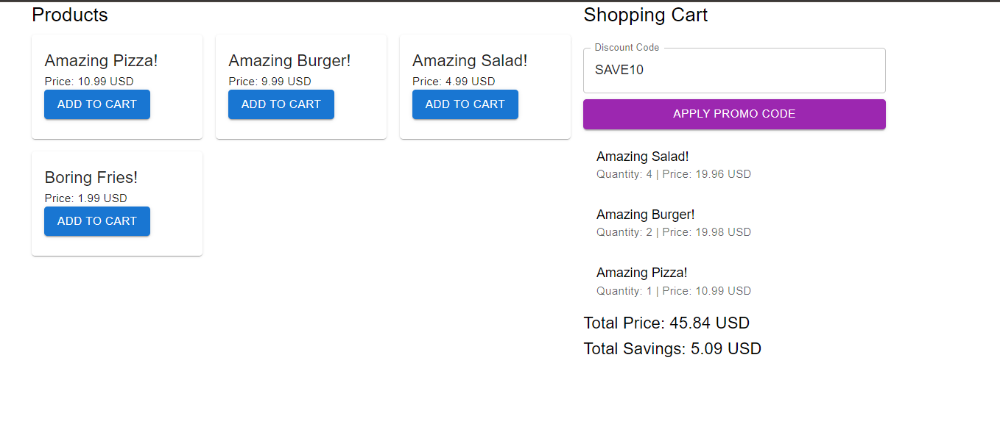

# Cart System Application

## Overview

This project consists of a full-stack application for managing a cart system shopping and applying promotions. The backend is built with Java and Spring Boot, while the frontend is developed using React. 



## Backend

### Description

A Java Spring Boot application that manages a shopping cart, allows adding items to the cart, applies promotions, and retrieves cart details. It interacts with a mock API (Wiremock) to fetch product information.

### API Endpoints

#### List All Products

- **Endpoint**: `GET /api/products`
- **Description**: Retrieves the list of all available products.

#### Add Item to Cart

- **Endpoint**: `POST /api/cart/add`
- **Parameters**:
  - `productId` (required): The ID of the product to add.
  - `quantity` (required): The quantity of the product to add.
- **Response**: Returns the updated cart with the items, total price, and total savings.

#### Apply Promotion

- **Endpoint**: `POST /api/cart/apply-promotion`
- **Parameters**:
  - `promotionCode` (required): The code for the promotion to apply.
- **Response**: Returns the updated cart with the applied promotion.

#### Retrieve Cart Details

- **Endpoint**: `GET /api/cart`
- **Response**: Returns the current state of the cart including items, total price, and total savings.

### Code Structure

- **Controller**: Manages API endpoints and request handling.
- **Service**: Contains business logic for cart management and promotion application.
- **Model**: Defines data structures for products, cart items, and cart.
- **Exception**: Handles custom exceptions and error responses.

## Frontend

### Description

A React application that lists products, allows users to add items to the cart, apply discount codes, and view cart details.

### Installation

1. **Clone the Repository**

    ```bash
    git clone https://github.com/PedroTeixeiraa/grocerycart.git
    cd grocerycart/cart-system-frontend
    ```

2. **Install Dependencies**

    ```bash
    npm install
    ```

3. **Start the Development Server**

    ```bash
    npm start
    ```

    The application will be available at `http://localhost:3000`.


# Follow-Up Questions
## 1. How long did you spend on the test? What would you add if you had more time?
```text
I spent approximately 4 working on the test. If I had more time, I would:
- Enhance Error Handling: Implement more robust error handling and validation throughout the application.
- Add Comprehensive Unit and Integration Tests: Ensure all edge cases are covered and verify the correctness of all components.
- Improve UI/UX: Refine the user interface and user experience based on usability testing feedback.
```

## 2. What was the most useful feature that was added to the latest version of your chosen language? Please include a snippet of code that shows how you've used it.
The most useful feature added in the latest version of Java is the `record` type for immutable data carriers. It simplifies the creation of data classes by providing a concise syntax for declaring classes that are mainly used to hold data.

Example:

```java
public record Product(String id, String name, int price) {}
```
In this example, `Product` is a record that automatically provides implementations for `equals()`, `hashCode()`, and `toString()` methods, reducing boilerplate code significantly.

## 3. What did you find most difficult?
The most challenging aspect was integrating the promotion logic into the cart service. Ensuring that promotions are applied correctly based on different conditions required careful consideration of various scenarios and testing to ensure accurate application of discounts.

## 4. What mechanism did you put in place to track down issues in production on this code? If you didn’t put anything, write down what you could do.

`Logging:` Use a robust logging framework `(Logback, Kibana, Elasticsearch)` to capture detailed logs of application behavior and errors.
`Monitoring and Alerts`: Integrate with monitoring tools `(Prometheus, Grafana)` to track application performance and set up alerts for critical issues.

`Error Tracking:` Utilize error tracking services `(Sentry)` to capture and report runtime errors and exceptions.

## 5. The Wiremock represents one source of information. We should be prepared to integrate with more sources. List the steps that we would need to take to add more sources of items with different formats and promotions.

`Define Common Interfaces:` Create common interfaces or abstract classes for item sources to ensure consistent interaction regardless of the underlying format.

`Implement Adapters:` Develop adapter classes or services to convert data from each source format into the common interface.
`Test Integration:` Thoroughly test the integration with each new data source to ensure data is fetched and processed correctly.